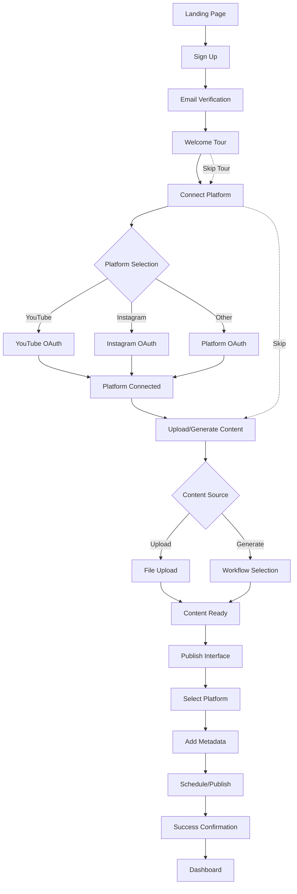
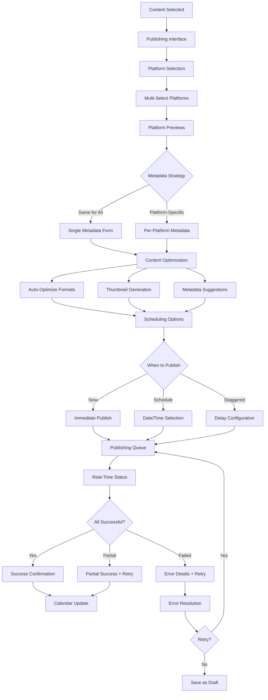
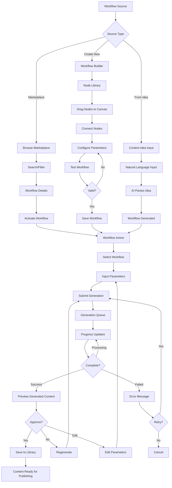
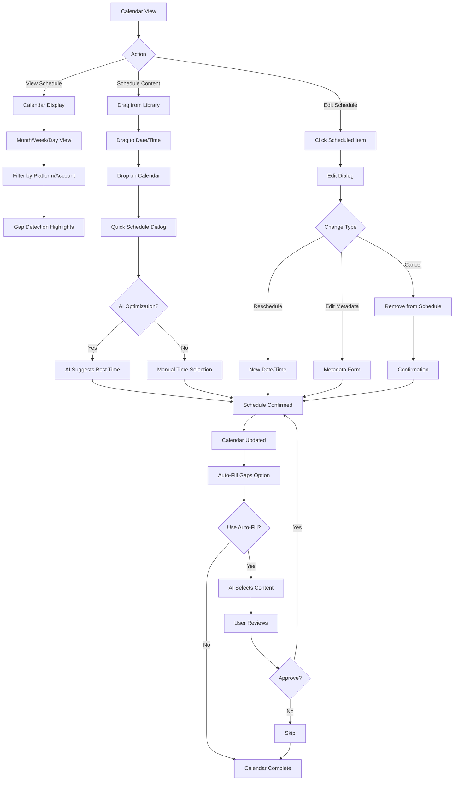
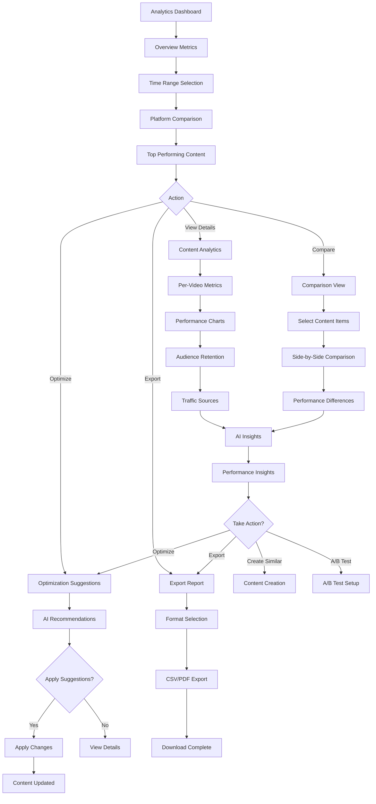
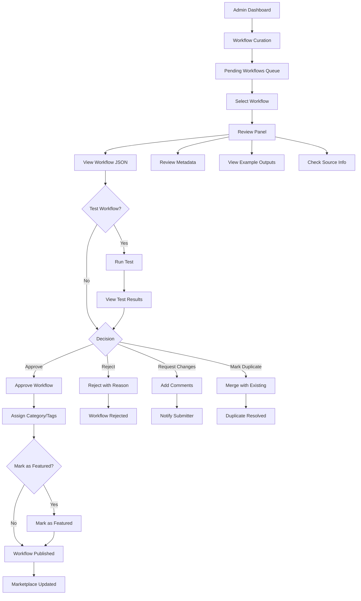
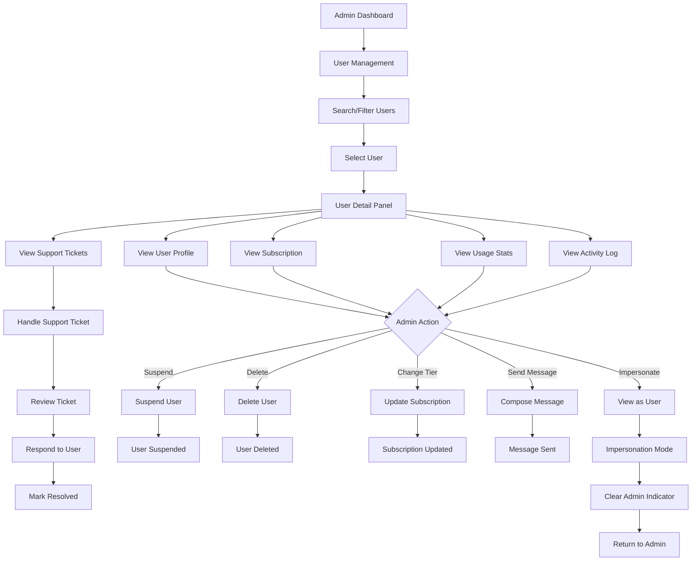
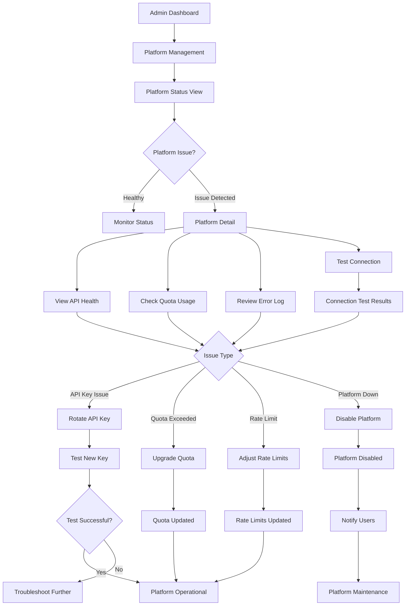

# MPCAS UI/UX Specification

**Version:** 1.0  
**Date:** January 2026  
**Status:** Draft  
**Project:** Multi-Platform Content Automation System (MPCAS)

---

## Introduction

This document defines the user experience goals, information architecture, user flows, and visual design specifications for MPCAS's user interface. It serves as the foundation for visual design and frontend development, ensuring a cohesive and user-centered experience that enables content creators, agencies, and resellers to efficiently manage multi-platform content automation.

The specification addresses the unique challenges of managing 8 social media platforms, AI-powered content generation, workflow automation, and white-label customization while maintaining simplicity and usability for users with varying technical expertise.

---

## Overall UX Goals & Principles

### Target User Personas

**1. Content Creator (Primary Persona)**
- **Demographics:** Age 18-45, $30K-$150K/year income, medium to high tech-savviness
- **Goals:** Reduce manual posting time by 80%+, maintain consistent schedule, optimize content per platform, track performance, generate content ideas
- **Pain Points:** Manual posting takes 2-3 hours per video, no unified analytics, limited AI tools, difficulty scaling
- **Key Needs:** One-click publishing, visual calendar, AI assistance, performance insights
- **Usage Pattern:** Daily active use, 3-7 posts per week, manages 3-12 accounts

**2. Agency Manager (Secondary Persona)**
- **Demographics:** Company size 5-50 employees, manages 5-200 client accounts, $100K-$5M revenue
- **Goals:** Scale to 100+ clients, increase profit margins, reduce operational overhead, improve client retention
- **Pain Points:** Uses 3-5 different tools per client, manual reporting takes 5-10 hours/month, high client churn, limited scalability
- **Key Needs:** White-label solution, unified dashboard, automated reporting, team collaboration, client portals
- **Usage Pattern:** Heavy daily use, manages multiple clients simultaneously, needs bulk operations

**3. Reseller (Tertiary Persona)**
- **Demographics:** Entrepreneurs, consultants, agencies wanting to white-label
- **Goals:** Charge $1,000-$2,000/month per client, manage 100+ sub-accounts, complete rebranding
- **Pain Points:** No white-label solutions available, expensive existing options, complex setup
- **Key Needs:** Complete branding removal, custom domain, reseller dashboard, revenue tracking
- **Usage Pattern:** Admin-focused, manages business operations, needs white-label customization

**4. Team Member (Supporting Persona)**
- **Demographics:** Part of agency team, various roles (Editor, Manager, Viewer)
- **Goals:** Collaborate efficiently, maintain quality, follow brand guidelines
- **Pain Points:** Unclear permissions, lack of collaboration tools, approval bottlenecks
- **Key Needs:** Clear role permissions, commenting system, approval workflows, activity visibility
- **Usage Pattern:** Regular use, role-specific tasks, collaboration-focused

### Usability Goals

1. **Ease of Learning:** New users can publish content to one platform within 5 minutes of signup without training
2. **Efficiency of Use:** Power users can schedule 10 posts across 8 platforms in under 2 minutes
3. **Error Prevention:** Clear validation prevents publishing errors, confirmation dialogs for destructive actions
4. **Memorability:** Infrequent users can return after 30 days and remember how to complete core tasks
5. **Satisfaction:** Users rate interface 4.5+/5 stars, NPS >50
6. **Accessibility:** All users including those with disabilities can complete core tasks independently
7. **Mobile Usability:** 80%+ of core features fully functional on mobile devices
8. **Performance Perception:** Interface feels instant (<100ms response) for common actions

### Design Principles

1. **Clarity Over Cleverness** - Prioritize clear communication and familiar patterns over aesthetic innovation. Users should understand functionality immediately without explanation.

2. **Progressive Disclosure** - Show only what's needed when it's needed. Advanced features (workflow builder, API access) hidden until user demonstrates need or explicitly requests access.

3. **Visual Hierarchy Through Information Architecture** - Most important actions (publish, schedule, view analytics) prominently displayed. Secondary actions (settings, advanced features) accessible but not distracting.

4. **Immediate Feedback** - Every user action provides instant visual feedback: button states, loading indicators, success confirmations, error messages with clear recovery paths.

5. **Consistent Patterns** - Use familiar UI patterns throughout (drag-and-drop, modal dialogs, data tables, filters). Once users learn a pattern, it works the same everywhere.

6. **Accessible by Default** - Design for all users from the start. Keyboard navigation, screen reader support, color contrast, and clear focus indicators are requirements, not afterthoughts.

7. **Contextual Intelligence** - AI assistant and smart defaults reduce cognitive load. System suggests optimal posting times, auto-generates metadata, detects content gaps.

8. **Forgiving Interface** - Easy undo/redo, draft auto-save, confirmation for destructive actions, clear error recovery paths. Users should never lose work or feel trapped.

### Change Log

| Date | Version | Description | Author |
|------|---------|-------------|---------|
| 2026-01-XX | 1.0 | Initial front-end specification creation | UX Expert Agent |

---

## Information Architecture (IA)

### Site Map / Screen Inventory

```mermaid
graph TD
    A[Login/Auth] --> B[Dashboard]
    A --> A1[OAuth: Google/Microsoft/Okta]
    A --> A2[Email/Password]
    A --> A3[2FA Setup]
    
    B --> B1[Overview Metrics]
    B --> B2[Recent Activity]
    B --> B3[Upcoming Posts]
    B --> B4[Quick Actions]
    B --> B5[AI Assistant]
    
    B --> C[Content Library]
    C --> C1[Grid/List View]
    C --> C2[Folders]
    C --> C3[Search & Filters]
    C --> C4[Asset Details]
    C --> C5[Version History]
    
    B --> D[Workflow Marketplace]
    D --> D1[Browse Workflows]
    D --> D2[Workflow Details]
    D --> D3[My Workflows]
    D --> D4[Workflow Builder]
    
    B --> E[Content Calendar]
    E --> E1[Month View]
    E --> E2[Week View]
    E --> E3[Day View]
    E --> E4[Agenda View]
    
    B --> F[Publishing Interface]
    F --> F1[Content Selection]
    F --> F2[Platform Selection]
    F --> F3[Metadata Per Platform]
    F --> F4[Scheduling Options]
    
    B --> G[Analytics Dashboard]
    G --> G1[Cross-Platform Overview]
    G --> G2[Per-Video Analytics]
    G --> G3[A/B Test Results]
    G --> G4[Client Reports]
    
    B --> H[Platform Connections]
    H --> H1[Connection Status]
    H --> H2[OAuth Flow]
    H --> H3[Account Management]
    
    B --> I[Team Management]
    I --> I1[Team Members]
    I --> I2[Roles & Permissions]
    I --> I3[Activity Feed]
    I --> I4[Approval Queue]
    
    B --> J[Settings]
    J --> J1[Profile]
    J --> J2[Billing & Subscription]
    J --> J3[Notifications]
    J --> J4[White Label Branding]
    J --> J5[API Keys]
    J --> J6[Integrations]
    
    B --> K[Client Portals - Agencies]
    K --> K1[Client Dashboard]
    K --> K2[Client Content Library]
    K --> K3[Client Analytics]
    K --> K4[Client Requests]
    
    B --> L[Admin Dashboard - System]
    L --> L1[User Management]
    L --> L2[Workflow Curation]
    L --> L3[Platform Management]
    L --> L4[System Health]
    L --> L5[Billing Controls]
```



### Navigation Structure

**Primary Navigation (Desktop):**
- **Horizontal Top Bar:** Logo, Primary Nav Items (Dashboard, Content, Workflows, Calendar, Analytics, Team, Settings), User Avatar Menu, Notifications, AI Assistant Icon
- **Primary Nav Items:**
  - Dashboard (home icon)
  - Content (folder icon) - Content Library, Asset Management
  - Workflows (nodes icon) - Marketplace, My Workflows, Builder
  - Calendar (calendar icon) - Content Calendar, Scheduling
  - Analytics (chart icon) - Performance Dashboard, Reports
  - Team (users icon) - Team Members, Collaboration (Agency+ only)
  - Settings (gear icon) - Profile, Billing, Preferences

**Secondary Navigation (Contextual):**
- **Left Sidebar (when applicable):** Context-specific navigation (e.g., Content Library: Folders, Tags, Filters; Analytics: Overview, Per-Video, A/B Tests)
- **Breadcrumbs:** Show current location and parent sections for deep navigation
- **Tabs:** Used within major sections (e.g., Analytics: Overview | Per-Video | A/B Tests | Reports)

**Mobile Navigation:**
- **Bottom Navigation Bar:** 5 primary items (Dashboard, Content, Calendar, Analytics, More)
- **Hamburger Menu:** Access to secondary items (Workflows, Team, Settings)
- **Floating Action Button:** Quick publish action (prominent, always accessible)

**Breadcrumb Strategy:**
- Displayed for screens 2+ levels deep
- Format: Dashboard > Content > Content Library > Video Details
- Clickable breadcrumbs for navigation
- Hidden on top-level screens (Dashboard, main sections)

---

## User Flows

### Flow 1: First-Time User Onboarding

**User Goal:** Sign up, connect first platform, and publish first piece of content successfully.

**Entry Points:** Landing page signup, email invitation, OAuth login

**Success Criteria:** User successfully publishes content to at least one platform within 10 minutes

**Flow Diagram:**


**Edge Cases & Error Handling:**
- OAuth cancellation: Return to platform selection with clear message
- OAuth failure: Show error with retry option and support link
- File upload failure: Show error with file size/format requirements and retry
- Content generation failure: Show error with retry option and alternative workflows
- Publishing failure: Show platform-specific error with retry and support options
- Network errors: Offline detection with queue for retry when online

**Notes:** Onboarding should be completable in under 10 minutes. Skip options available at each step. Progress indicator shows completion percentage.

### Flow 2: Multi-Platform Publishing

**User Goal:** Publish one piece of content to multiple platforms simultaneously with platform-specific optimization.

**Entry Points:** Content Library (select content), Calendar (drag content), Dashboard (quick publish), Publishing Interface (direct)

**Success Criteria:** Content published to all selected platforms with correct metadata and formatting per platform

**Flow Diagram:**


**Edge Cases & Error Handling:**
- Platform connection lost: Show which platforms failed, allow retry for failed only
- Metadata too long: Character counter with truncation warning, auto-suggest shorter version
- Format conversion failure: Show error with manual format option
- Rate limit exceeded: Queue for later with estimated time, notify user
- Partial success: Clear indication of which platforms succeeded/failed, one-click retry for failures
- Network interruption: Auto-save draft, resume on reconnection

**Notes:** Platform-specific previews show exactly how content will appear. Optimization happens automatically but can be overridden. Staggered posting helps avoid detection patterns.

### Flow 3: Workflow Creation & Content Generation

**User Goal:** Create or activate a workflow and generate content using AI.

**Entry Points:** Workflow Marketplace (activate), Workflow Builder (create new), Content Library (generate from idea)

**Success Criteria:** Content generated successfully and available in library for publishing

**Flow Diagram:**


**Edge Cases & Error Handling:**
- Workflow activation limit reached: Show upgrade prompt with tier comparison
- Invalid workflow: Show validation errors with node-level details
- Generation timeout: Show progress, allow cancellation, offer to queue for later
- Generation failure: Show error with retry option, suggest alternative workflows
- Low quality output: Allow regeneration with parameter adjustment
- GPU queue full: Show estimated wait time, option to queue or cancel

**Notes:** Workflow builder uses visual node-based interface (ReactFlow). AI workflow generation from natural language reduces barrier to entry. Progress updates keep users informed during long generations.

### Flow 4: Content Calendar Management

**User Goal:** Schedule multiple content items across time periods with optimal posting times.

**Entry Points:** Calendar view (direct), Content Library (drag to calendar), Publishing Interface (schedule option)

**Success Criteria:** Content scheduled across desired time periods with optimal timing per platform

**Flow Diagram:**


**Edge Cases & Error Handling:**
- Scheduling conflict: Warn if multiple posts for same account at same time, suggest alternatives
- Past date selection: Prevent scheduling in past, show error with current time suggestion
- Timezone confusion: Show local time and platform timezone clearly, auto-detect user timezone
- Recurring schedule error: Validate recurrence pattern, show preview of next 5 occurrences
- Calendar export failure: Show error with retry, offer alternative format

**Notes:** Drag-and-drop is primary interaction. AI best time suggestions reduce decision fatigue. Gap detection helps maintain consistent posting schedule.

### Flow 5: Analytics Review & Optimization

**User Goal:** Understand content performance and identify optimization opportunities.

**Entry Points:** Analytics Dashboard (direct), Content Library (view analytics), Email notifications (performance alerts)

**Success Criteria:** User identifies top performing content, understands performance trends, and takes action to optimize

**Flow Diagram:**


**Edge Cases & Error Handling:**
- Data not available: Show "Data collection in progress" with estimated availability time
- Platform API errors: Show which platforms have missing data, retry option
- Export failure: Show error with retry, offer alternative format
- Comparison limitations: Warn if comparing different content types or time periods
- Insight generation failure: Show fallback insights or manual analysis option

**Notes:** Analytics should be actionable, not just informative. AI insights translate data into concrete recommendations. Export functionality enables external analysis and reporting.

### Flow 6: Team Collaboration & Approval

**User Goal:** Collaborate with team members and get content approved before publishing.

**Entry Points:** Content Library (submit for approval), Approval Queue (review), Activity Feed (see team activity)

**Success Criteria:** Content reviewed, feedback provided, and approved/rejected with clear communication

**Flow Diagram:**
```mermaid
graph TD
    A[Content Created] --> B{Requires Approval?}
    B -->|Yes| C[Submit for Approval]
    B -->|No| D[Publish Directly]
    
    C --> E[Approval Queue]
    E --> F[Manager/Admin Reviews]
    F --> F1[View Content]
    F1 --> F2[Review Metadata]
    F2 --> G{Decision}
    G -->|Approve| H[Content Approved]
    G -->|Reject| I[Rejection with Reason]
    G -->|Request Changes| J[Change Request]
    
    H --> K[Auto-Publish or Queue]
    
    I --> L[Creator Notified]
    L --> M{Action}
    M -->|Edit & Resubmit| N[Edit Content]
    M -->|Archive| O[Move to Archive]
    N --> C
    
    J --> P[Change Comments]
    P --> L
    L --> N
    
    Q[Team Activity] --> Q1[Activity Feed]
    Q1 --> Q2[See Team Actions]
    Q2 --> Q3[@Mention Team Members]
    Q3 --> R[Notifications Sent]
    
    S[Content Commenting] --> S1[Add Comment]
    S1 --> S2[@Mention User]
    S2 --> S3[Thread Discussion]
    S3 --> T[Resolve Comment]
```

**Edge Cases & Error Handling:**
- Approval timeout: Auto-approve after X hours with notification to approver
- Multiple approvers: Show approval status from each, require all or any (configurable)
- Comment conflicts: Handle simultaneous comments gracefully, show all comments
- Notification failure: Log notification attempts, retry with exponential backoff
- Permission errors: Clear message explaining why action not allowed, suggest requesting permission

**Notes:** Approval workflow should be fast (swipe-to-approve on mobile). Comments support threaded discussions. Activity feed provides transparency without being overwhelming.

### Flow 7: Admin Workflow Curation

**User Goal:** Review and approve workflows from automated scraping to maintain marketplace quality.

**Entry Points:** Admin Dashboard (Workflow Curation), Notification (new workflow pending)

**Success Criteria:** Workflow reviewed, tested, and approved/rejected with appropriate categorization

**Flow Diagram:**


**Edge Cases & Error Handling:**
- Workflow test failure: Show error details, allow retry, option to reject or request fixes
- Invalid workflow JSON: Show validation errors, highlight problematic sections
- Duplicate detection: Show similarity score, allow admin to confirm merge or keep separate
- Bulk approval failure: Show which workflows failed, allow partial approval
- Workflow already approved: Warn if workflow was already approved, prevent duplicate approval

**Notes:** Workflow review should be efficient with keyboard shortcuts. Test results help validate quality. Duplicate detection prevents marketplace clutter.

### Flow 8: Admin User Management

**User Goal:** Manage platform users, handle support requests, and perform administrative actions.

**Entry Points:** Admin Dashboard (User Management), Support ticket notification, User search

**Success Criteria:** User issue resolved or administrative action completed successfully

**Flow Diagram:**


**Edge Cases & Error Handling:**
- User deletion with active subscription: Warn about subscription cancellation, require confirmation
- Bulk action failure: Show which users failed, allow retry for failed only
- Impersonation security: Clear audit trail, require re-authentication to return
- Support ticket escalation: Option to escalate to senior admin or external support
- User data export: Handle large exports, show progress, email when complete

**Notes:** User management requires careful handling of sensitive data. All actions are logged for audit. Impersonation should be used sparingly with clear indicators.

### Flow 9: Admin Platform Management

**User Goal:** Monitor platform API health, manage API keys, and resolve platform issues.

**Entry Points:** Admin Dashboard (Platform Management), Platform alert notification

**Success Criteria:** Platform issue identified and resolved, or platform configuration updated

**Flow Diagram:**


**Edge Cases & Error Handling:**
- API key rotation failure: Keep old key active, show error, allow retry
- Platform API changes: Detect deprecation notices, show migration requirements
- Quota upgrade unavailable: Show alternative solutions, contact platform support option
- Multiple platform issues: Prioritize critical issues, show impact assessment
- Platform disable with active users: Warn about impact, show affected user count, require confirmation

**Notes:** Platform management requires proactive monitoring. Automated health checks reduce manual effort. Platform issues should be resolved quickly to minimize user impact.

---

## Wireframes & Mockups

### Design Files

**Primary Design Tool:** Figma (recommended) or equivalent  
**Design File Structure:**
- `01_Design_System` - Component library, tokens, patterns
- `02_Authentication` - Login, signup, OAuth flows
- `03_Dashboard` - Main dashboard, overview, quick actions
- `04_Content_Library` - Media library, asset management, DAM
- `05_Workflow_Marketplace` - Browse, search, activate workflows
- `06_Workflow_Builder` - Visual workflow creation interface
- `07_Publishing` - Unified publishing interface, platform selection
- `08_Calendar` - Content calendar, scheduling, gap detection
- `09_Analytics` - Dashboards, charts, reports, A/B tests
- `10_Platform_Connections` - OAuth management, account health
- `11_Team_Collaboration` - Team management, approval queue, comments
- `12_White_Label` - Branding customization, client portals
- `13_Settings` - User settings, billing, preferences
- `14_Admin` - Admin dashboard, system management
- `15_Mobile` - Mobile-optimized layouts

**Design File Reference:** [To be created in Figma - link to be added]

### Key Screen Layouts

#### Screen 1: Main Dashboard

**Purpose:** Provide overview of platform activity, quick access to common tasks, and key metrics at a glance.

**Key Elements:**
- **Header:** Logo, primary navigation, user avatar menu, notifications bell, AI assistant icon
- **Metrics Cards:** Total views (30 days), engagement rate, follower growth, upcoming posts count
- **Quick Actions Bar:** "Publish Content", "Schedule Post", "Generate Content", "View Analytics"
- **Recent Activity Feed:** Last 10 actions (published, scheduled, generated, team activity)
- **Upcoming Posts Widget:** Next 5 scheduled posts with platform icons and times
- **Top Performing Content:** 3 best performing videos/posts with thumbnails and metrics
- **Platform Status:** Connection health for all 8 platforms (green/yellow/red indicators)
- **AI Assistant:** Persistent chat interface (bottom-right, collapsible)

**Interaction Notes:**
- Clicking metric cards navigates to detailed analytics
- Quick actions open relevant interfaces (publishing, calendar, etc.)
- Activity feed items are clickable to view details
- Upcoming posts can be edited/rescheduled directly from widget
- Platform status indicators show connection issues on hover

**Design File Reference:** `03_Dashboard/Frames/Dashboard_Overview`

#### Screen 2: Unified Publishing Interface

**Purpose:** Enable users to publish content to multiple platforms from a single interface with platform-specific optimization.

**Key Elements:**
- **Content Selection:** Drag-and-drop area or file picker, content preview, content library browser
- **Platform Selection Grid:** 8 platform cards with checkboxes, connection status, account selection per platform
- **Platform-Specific Previews:** Live preview showing how content appears on each selected platform
- **Metadata Forms:** Tabbed interface or accordion for per-platform metadata (title, description, hashtags, thumbnail)
- **Optimization Panel:** Auto-optimization toggle, format conversion preview, AI suggestions
- **Scheduling Options:** Publish now, schedule for date/time, staggered posting configuration
- **Action Bar:** "Publish Now", "Schedule", "Save as Draft" buttons with loading states

**Interaction Notes:**
- Platform cards show connection status and allow account selection
- Metadata forms auto-save as user types
- Platform previews update in real-time as metadata changes
- Optimization suggestions can be accepted/rejected individually
- Staggered posting shows timeline visualization

**Design File Reference:** `07_Publishing/Frames/Unified_Publishing`

#### Screen 3: Content Calendar

**Purpose:** Visual representation of scheduled content with drag-and-drop scheduling and gap detection.

**Key Elements:**
- **View Selector:** Month/Week/Day/Agenda toggle buttons
- **Calendar Grid:** Date cells with post indicators, color-coded by status
- **Timeline (Week/Day View):** Hour-by-hour slots with scheduled posts
- **Content Library Sidebar:** Draggable content items for scheduling
- **Status Legend:** Color coding explanation (published, scheduled, draft, needs approval, failed)
- **Gap Detection:** Highlighted empty days with "Fill Gaps" button
- **AI Best Time Indicators:** Suggested optimal posting times marked on calendar
- **Filter Bar:** Filter by platform, account, status, content type

**Interaction Notes:**
- Drag content from library to calendar to schedule instantly
- Drag scheduled posts to reschedule
- Click calendar items to view/edit post details
- Multi-select posts for bulk operations
- Gap detection shows alert with auto-fill option

**Design File Reference:** `08_Calendar/Frames/Calendar_Month_View`, `08_Calendar/Frames/Calendar_Week_View`

#### Screen 4: Workflow Marketplace

**Purpose:** Browse, search, and activate pre-built workflows for content generation.

**Key Elements:**
- **Search Bar:** Full-text search with autocomplete
- **Filter Sidebar:** Categories, base models, platforms, complexity, features
- **Sort Options:** Latest, Trending, Most Downloaded, Highest Rated, Price
- **Workflow Grid:** Cards showing preview image, name, creator, rating, downloads, price, tags
- **Workflow Detail Modal:** Full description, technical details, example outputs, reviews, changelog
- **Activation Button:** "Activate Workflow" with tier limit check and upgrade prompt if needed
- **My Workflows Tab:** List of activated workflows with usage stats

**Interaction Notes:**
- Workflow cards show hover state with quick preview
- Click card opens detail modal with full information
- Activation checks tier limits and shows upgrade prompt if needed
- Filters update results in real-time
- Search highlights matching terms in results

**Design File Reference:** `05_Workflow_Marketplace/Frames/Marketplace_Browse`

#### Screen 5: Analytics Dashboard

**Purpose:** Comprehensive view of content performance across all platforms with actionable insights.

**Key Elements:**
- **Time Range Selector:** Preset ranges (7d, 30d, 90d) and custom range picker
- **Overview Metrics:** Total views, total engagement, engagement rate, follower growth (large numbers with % change)
- **Platform Comparison Chart:** Bar/line chart comparing metrics across platforms
- **Engagement Trend Chart:** Line chart showing engagement rate over time
- **Top Performing Content:** Grid of top 10 videos/posts with thumbnails and key metrics
- **Performance Insights Panel:** AI-generated insights with actionable recommendations
- **Export Button:** Download data as CSV or PDF
- **Filter Bar:** Filter by platform, account, content type, date range

**Interaction Notes:**
- Charts are interactive (hover for details, click to drill down)
- Top content items clickable to view detailed analytics
- Insights panel has "Apply Suggestions" button for quick optimization
- Time range changes update all metrics and charts
- Export includes current filters and time range

**Design File Reference:** `09_Analytics/Frames/Analytics_Dashboard`

#### Screen 6: Workflow Builder

**Purpose:** Visual interface for creating and editing custom workflows using node-based system.

**Key Elements:**
- **Canvas:** Infinite scroll workspace with zoom controls, grid background
- **Node Library Sidebar:** Categorized nodes (Content, Social Media, AI, Data, Logic) with search
- **Properties Panel:** Dynamic form based on selected node showing parameters and configuration
- **Toolbar:** Save, Deploy, Test, Undo/Redo, Zoom controls, Layout options
- **Node Connections:** Visual lines connecting nodes with type validation
- **Validation Panel:** Real-time validation showing errors and warnings
- **AI Suggestions:** Context-aware node suggestions and optimization tips

**Interaction Notes:**
- Drag nodes from library to canvas
- Connect nodes by dragging from output to input ports
- Click node to select and show properties panel
- Right-click node for context menu (delete, duplicate, etc.)
- Canvas supports pan and zoom for complex workflows
- Validation shows errors in real-time with fix suggestions

**Design File Reference:** `06_Workflow_Builder/Frames/Workflow_Canvas`

#### Screen 7: Admin Dashboard

**Purpose:** Comprehensive system administration interface for managing users, workflows, platforms, system health, and configuration.

**Key Elements:**
- **Header:** Admin badge indicator, system status indicator (operational/maintenance), quick actions menu
- **System Health Overview:** Real-time metrics (active users, API health, system load, error rate, uptime)
- **Quick Stats Cards:** Total users, active subscriptions, workflows in marketplace, platform API status, system alerts
- **Navigation Tabs/Sidebar:** 
  - Dashboard Overview
  - User Management
  - Workflow Curation
  - Platform Management
  - System Configuration
  - Billing Controls
  - Premium Services
  - System Logs
- **Recent Activity Feed:** System events, user actions, API errors, workflow approvals
- **Alert Panel:** Critical system alerts, platform API issues, quota warnings, security events
- **Quick Actions:** Bulk user operations, workflow approval, platform testing, system maintenance mode

**Interaction Notes:**
- System health indicators show green/yellow/red status with drill-down to details
- Quick stats cards are clickable to navigate to detailed views
- Alert panel shows priority alerts with acknowledge/dismiss actions
- Navigation uses tabs or sidebar depending on screen size
- All admin actions require confirmation for destructive operations
- Real-time updates for system metrics and alerts

**Design File Reference:** `14_Admin/Frames/Admin_Dashboard_Overview`

#### Screen 7.1: User Management (Admin)

**Purpose:** Manage all platform users, view user details, perform bulk operations, and handle user support.

**Key Elements:**
- **User Search & Filters:** Search by email/name, filter by tier, status (active/suspended/deleted), registration date, subscription status
- **User Table:** Columns - Email, Name, Tier, Status, Registration Date, Last Active, Subscription Status, Actions
- **Bulk Actions Bar:** Select all/none, bulk actions (suspend, delete, change tier, send message, export)
- **User Detail Panel/Modal:** 
  - User profile information
  - Subscription details and billing history
  - Usage statistics (content published, workflows used, API calls)
  - Connected platforms and account status
  - Support tickets and communication history
  - Activity log (recent actions)
  - Admin actions (suspend, delete, change tier, send message, impersonate)
- **User Import/Export:** CSV import for bulk user creation, export user data
- **User Analytics:** Charts showing user growth, tier distribution, retention metrics, engagement trends

**Interaction Notes:**
- User table supports sorting, filtering, and pagination
- Click user row to open detail panel/modal
- Bulk actions show confirmation dialog with affected user count
- User detail panel shows comprehensive information in tabs
- Impersonate feature allows admin to view as user (with clear indicator)
- Export includes current filters and selected users

**Design File Reference:** `14_Admin/Frames/Admin_User_Management`

#### Screen 7.2: Workflow Curation (Admin)

**Purpose:** Review, approve, reject, and manage workflows from automated scraping and user submissions.

**Key Elements:**
- **Workflow Queue Tabs:** Pending Review, Approved, Rejected, Duplicates, Featured
- **Workflow List/Grid:** Shows workflow name, source, submission date, status, category, rating
- **Workflow Review Panel:**
  - Workflow JSON viewer (syntax highlighted, collapsible sections)
  - Metadata editor (name, description, tags, category, pricing tier)
  - Example outputs preview (generated samples)
  - Source information (scraped from, original URL, submitter)
  - Quality test results (test run outputs, validation status)
- **Review Actions:** Approve, Reject (with reason), Mark as Featured, Mark as Premium, Assign Category/Tags, Edit Metadata, Test Workflow
- **Bulk Actions:** Approve/reject multiple, assign category/tags in bulk, mark as featured
- **Duplicate Detection:** Shows potential duplicates with similarity score, merge option
- **Workflow Analytics:** Performance metrics (downloads, ratings, usage count, revenue)
- **Moderation Tools:** Remove inappropriate workflows, handle user reports, ban submitter

**Interaction Notes:**
- Workflow queue shows status badges (pending, approved, rejected)
- Click workflow to open review panel with full details
- Test workflow button runs workflow and shows outputs
- Duplicate detection highlights similar workflows with merge option
- Bulk actions require confirmation
- Workflow analytics show in sidebar or modal
- Moderation actions log reason and admin who performed action

**Design File Reference:** `14_Admin/Frames/Admin_Workflow_Curation`

#### Screen 7.3: Platform Management (Admin)

**Purpose:** Monitor and manage platform API integrations, configure API keys, track quotas, and handle platform issues.

**Key Elements:**
- **Platform Status Dashboard:** Grid of 8 platforms showing:
  - Health status (operational, degraded, down)
  - API quota usage (percentage with visual indicator)
  - Rate limit status (current usage, violations)
  - Last successful API call timestamp
  - Error rate (last 24 hours)
- **Platform Detail Panel:**
  - API key management (view, rotate, test)
  - Quota monitoring (current usage, reset date, alerts)
  - Rate limit tracking (requests per minute/hour, violations log)
  - Health check results (automated test results, response times)
  - Error log (recent API errors with details)
  - Usage statistics (API calls per day, success rate, average response time)
  - Configuration settings (platform-specific limits, timeouts, retry logic)
- **Platform Actions:** Enable/Disable platform, Test Connection, Run Health Check, View Documentation
- **Alerts Panel:** Quota warnings (80% threshold), rate limit violations, API errors, platform deprecation notices
- **Platform Updates Tracker:** Track platform API changes, deprecations, new features, migration requirements

**Interaction Notes:**
- Platform status cards show color-coded health (green/yellow/red)
- Click platform card to open detail panel
- API key rotation requires confirmation and shows new key
- Quota usage shows visual progress bar with alert at 80%
- Health checks can be run manually or scheduled
- Error log shows stack traces and request/response details
- Platform disable shows warning and requires confirmation

**Design File Reference:** `14_Admin/Frames/Admin_Platform_Management`

#### Screen 7.4: System Configuration (Admin)

**Purpose:** Configure system-wide settings, feature flags, security, integrations, and maintenance mode.

**Key Elements:**
- **Settings Navigation:** Tabs or sidebar for:
  - General Settings
  - Email Configuration
  - Notifications
  - Security
  - Feature Flags
  - System Limits
  - Integrations
  - Backup & Restore
  - Monitoring & Alerts
- **General Settings:**
  - Feature toggles (enable/disable platform features)
  - Tier limits and pricing configuration
  - Default settings for new users
  - Branding defaults
- **Email Configuration:**
  - SMTP settings (host, port, auth, encryption)
  - Email templates (welcome, notifications, receipts)
  - Email delivery testing
  - Email logs
- **Security Settings:**
  - Encryption settings (algorithm, key rotation)
  - Audit log retention (days, storage)
  - Session timeout configuration
  - 2FA enforcement (required for all users or specific tiers)
  - IP whitelist/blacklist management
  - Password policy (length, complexity, expiration)
- **Feature Flags:**
  - Toggle features on/off (A/B testing, gradual rollout)
  - Feature flag per tier or user segment
  - Feature flag history and rollback
- **System Limits:**
  - Max file size, max workflow nodes, max API calls per minute
  - Rate limits per tier
  - Storage limits
- **Integration Settings:**
  - Stripe configuration (API keys, webhooks, test mode)
  - SendGrid/AWS SES configuration
  - Twilio configuration
  - External service API keys
- **Backup & Restore:**
  - Backup schedule (daily, weekly, monthly)
  - Backup retention policy
  - Manual backup trigger
  - Restore from backup (with confirmation)
- **Monitoring & Alerts:**
  - Alert thresholds (CPU, memory, disk, API errors)
  - Notification channels (email, SMS, Slack, PagerDuty)
  - Alert rules and conditions
- **Maintenance Mode:**
  - Toggle maintenance mode on/off
  - Custom maintenance message
  - Allow admin access during maintenance
  - Schedule maintenance window

**Interaction Notes:**
- Settings organized in logical groups with clear labels
- Each setting shows current value and description
- Changes require save confirmation
- Critical settings (security, maintenance mode) require additional confirmation
- Feature flags show impact (affected users, rollout percentage)
- Integration settings include test connection buttons
- Backup/restore shows progress and completion status
- Maintenance mode shows countdown and affected users

**Design File Reference:** `14_Admin/Frames/Admin_System_Configuration`

#### Screen 7.5: Billing Controls (Admin)

**Purpose:** Manage subscription billing, overage charges, credits, and revenue reporting.

**Key Elements:**
- **Revenue Overview:** Total revenue, MRR (Monthly Recurring Revenue), ARR (Annual Recurring Revenue), churn rate, LTV (Lifetime Value)
- **Subscription Management:**
  - User subscription list (filter by tier, status, payment method)
  - Subscription details (plan, billing cycle, next billing date, amount)
  - Subscription actions (upgrade, downgrade, cancel, refund)
  - Payment method management
- **Overage Management:**
  - Overage charges list (user, service, amount, date)
  - Overage revenue reporting (total, by service, by tier)
  - Overage waiver (waive charges for specific users)
  - Overage threshold configuration
- **Credit System:**
  - Credit balance per user
  - Credit transactions (earned, spent, expired)
  - Credit payout configuration
  - Credit reporting (total credits issued, redeemed, outstanding)
- **Billing History:**
  - All transactions (subscriptions, overages, refunds)
  - Export billing data (CSV, PDF)
  - Invoice management (view, regenerate, send)
- **Revenue Analytics:**
  - Revenue trends (charts showing growth over time)
  - Tier distribution (revenue by tier)
  - Churn analysis (churned users, reasons, retention rate)
  - Top revenue users

**Interaction Notes:**
- Revenue metrics update in real-time or on refresh
- Subscription list supports search, filter, and sort
- Subscription actions show confirmation with impact
- Overage waivers require reason and approval
- Credit transactions show detailed history
- Billing export includes date range and filters
- Revenue charts are interactive (hover for details, click to drill down)

**Design File Reference:** `14_Admin/Frames/Admin_Billing_Controls`

---

## Component Library / Design System

### Design System Approach

**Base Framework:** shadcn/ui (Radix UI primitives) with Tailwind CSS  
**Rationale:** shadcn/ui provides accessible, customizable components that can be styled to match brand. Tailwind enables rapid development and consistent spacing/colors. Radix UI ensures accessibility out of the box.

**Component Architecture:**
- **Base Components:** Button, Input, Select, Card, Dialog, etc. (shadcn/ui)
- **Composite Components:** Built from base components (PublishingForm, CalendarView, WorkflowCanvas)
- **Layout Components:** Page layouts, navigation, sidebars, headers
- **Feature Components:** Platform-specific components (PlatformCard, AnalyticsChart, WorkflowNode)

**Customization:**
- Components support theming via CSS variables
- White-label tier can override all design tokens
- Dark mode support via theme switching
- Component variants for different use cases

### Core Components

#### Component: Button

**Purpose:** Primary interactive element for user actions throughout the application.

**Variants:**
- Primary (solid, brand color)
- Secondary (outline)
- Ghost (minimal, for icon buttons)
- Destructive (red, for delete/cancel actions)
- Link (text button, looks like link)

**States:**
- Default, Hover, Active, Focus, Disabled, Loading

**Usage Guidelines:**
- Primary variant for main actions (Publish, Save, Confirm)
- Secondary for alternative actions
- Ghost for toolbar actions and icon buttons
- Destructive for delete/cancel with confirmation
- Loading state shows spinner and disables interaction
- Minimum touch target: 44x44px (mobile)

#### Component: Data Table

**Purpose:** Display tabular data with sorting, filtering, and pagination.

**Variants:**
- Default (bordered rows)
- Compact (dense spacing for many rows)
- Striped (alternating row colors)

**States:**
- Default, Hover (row highlight), Selected (checkbox selection), Loading (skeleton rows)

**Usage Guidelines:**
- Use for content lists, user management, analytics data
- Always include sortable headers where applicable
- Pagination for 20+ rows
- Bulk actions when multiple selection enabled
- Responsive: horizontal scroll on mobile, or card view

#### Component: Modal/Dialog

**Purpose:** Overlay dialogs for focused tasks, confirmations, and detailed views.

**Variants:**
- Default (centered, medium size)
- Large (for complex forms)
- Full-screen (mobile, for complex workflows)
- Alert (for confirmations, smaller)

**States:**
- Open, Closing (animation), Loading (with spinner overlay)

**Usage Guidelines:**
- Use for forms, confirmations, detail views
- Always include close button (X) and escape key support
- Focus trap inside modal
- Backdrop click closes (unless destructive action)
- Mobile: full-screen or bottom sheet pattern

#### Component: Form Input

**Purpose:** Text input, textarea, select, date picker, file upload with validation.

**Variants:**
- Text (single line)
- Textarea (multi-line)
- Select (dropdown)
- Multi-select (tags)
- Date/Time picker
- File upload (drag-and-drop or picker)

**States:**
- Default, Focus, Error (with message), Disabled, Loading

**Usage Guidelines:**
- Always show label (not placeholder-only)
- Error messages below input, red text
- Character counters for limited inputs (titles, captions)
- Validation on blur, not on every keystroke
- Autocomplete where helpful (platform names, hashtags)

#### Component: Card

**Purpose:** Container for related content, used throughout for content items, metrics, widgets.

**Variants:**
- Default (with shadow)
- Elevated (more shadow for emphasis)
- Outlined (border only, no shadow)
- Interactive (hover effect, clickable)

**States:**
- Default, Hover, Selected, Loading (skeleton)

**Usage Guidelines:**
- Use for content items, metric displays, feature cards
- Interactive cards show hover state and cursor pointer
- Consistent padding and spacing
- Responsive: stack on mobile

#### Component: Badge/Status Indicator

**Purpose:** Show status, tags, counts, and categorical information.

**Variants:**
- Status (published, scheduled, draft, failed - color-coded)
- Tag (hashtags, categories - removable)
- Count (notification count, item count)
- Tier (subscription tier badge)

**States:**
- Default, Hover (for interactive badges)

**Usage Guidelines:**
- Color coding: Green (success), Blue (info), Yellow (warning), Red (error), Gray (neutral)
- Status badges show at-a-glance information
- Tags support removal (X icon)
- Count badges show number, hide when 0

#### Component: Chart/Graph

**Purpose:** Visualize data for analytics and reporting.

**Variants:**
- Line chart (trends over time)
- Bar chart (comparisons)
- Pie chart (proportions)
- Area chart (cumulative trends)

**States:**
- Default, Loading (skeleton), Empty (no data message), Error (retry option)

**Usage Guidelines:**
- Interactive: hover for details, click to drill down
- Responsive: scales to container
- Accessible: screen reader descriptions, high contrast colors
- Export option available
- Time range selector affects all charts

#### Component: Drag-and-Drop Zone

**Purpose:** Enable drag-and-drop interactions for scheduling, workflow building, file uploads.

**Variants:**
- File upload (drag files)
- Calendar drop (drag content to schedule)
- Workflow canvas (drag nodes)

**States:**
- Default, Dragging (highlight drop zones), Over (drop zone highlight), Invalid (reject drop)

**Usage Guidelines:**
- Clear visual feedback during drag (ghost image, highlight drop zones)
- Show what can be dropped where
- Reject invalid drops with clear message
- Touch support for mobile (long-press to start drag)

#### Component: AI Assistant Chat

**Purpose:** Persistent AI assistant providing context-aware help and suggestions.

**Variants:**
- Minimized (floating button, bottom-right)
- Expanded (chat window, bottom-right or side panel)
- Full-screen (mobile)

**States:**
- Minimized, Expanded, Typing (AI response loading), Error (retry option)

**Usage Guidelines:**
- Always accessible from any page (floating button)
- Context-aware: knows current page and user's content
- Rich responses: text, links, buttons for quick actions
- Conversation history persists
- Voice input optional (future enhancement)

---

## Branding & Style Guide

### Visual Identity

**Brand Guidelines:** Modern, professional SaaS platform aesthetic emphasizing clarity, efficiency, and trust. The design should feel powerful yet approachable, technical yet intuitive.

**Brand Personality:**
- **Professional:** Clean, organized, enterprise-ready
- **Innovative:** Modern interactions, AI-powered features
- **Efficient:** Streamlined workflows, minimal friction
- **Trustworthy:** Clear communication, reliable performance
- **Approachable:** Friendly help, supportive guidance

### Color Palette

| Color Type | Hex Code | Usage |
|------------|----------|-------|
| Primary | #3498db | Primary actions, links, brand elements |
| Primary Dark | #2980b9 | Primary hover states, emphasis |
| Secondary | #2ecc71 | Success states, positive actions |
| Accent | #e74c3c | Destructive actions, errors, warnings |
| Success | #27ae60 | Success messages, confirmations |
| Warning | #f39c12 | Warnings, cautions, important notices |
| Error | #e74c3c | Errors, destructive actions, failures |
| Info | #3498db | Informational messages, tooltips |
| Neutral Light | #ecf0f1 | Backgrounds, subtle borders |
| Neutral Medium | #bdc3c7 | Borders, dividers, disabled states |
| Neutral Dark | #7f8c8d | Secondary text, placeholders |
| Text Primary | #2c3e50 | Primary text, headings |
| Text Secondary | #7f8c8d | Secondary text, captions |
| Background | #ffffff | Main background (light mode) |
| Background Alt | #f8f9fa | Alternate backgrounds, cards |
| Surface | #ffffff | Card backgrounds, modals |
| Surface Elevation | #ffffff with shadow | Elevated cards, dropdowns |

**Dark Mode Colors:**
- Background: #1a1a1a
- Surface: #2d2d2d
- Text Primary: #ffffff
- Text Secondary: #b0b0b0
- Borders: #404040

### Typography

**Font Families:**
- **Primary:** Inter (sans-serif) - Clean, modern, excellent readability
- **Secondary:** Inter (fallback to system sans-serif)
- **Monospace:** JetBrains Mono or Fira Code - For code, technical data, workflow nodes

**Type Scale:**

| Element | Size | Weight | Line Height | Usage |
|---------|------|--------|-------------|-------|
| H1 | 32px (2rem) | 700 (Bold) | 1.2 | Page titles, major headings |
| H2 | 24px (1.5rem) | 600 (Semi-bold) | 1.3 | Section headings |
| H3 | 20px (1.25rem) | 600 (Semi-bold) | 1.4 | Subsection headings |
| H4 | 18px (1.125rem) | 600 (Semi-bold) | 1.4 | Card titles, widget headings |
| Body Large | 16px (1rem) | 400 (Regular) | 1.5 | Primary body text |
| Body | 14px (0.875rem) | 400 (Regular) | 1.5 | Default body text, descriptions |
| Small | 12px (0.75rem) | 400 (Regular) | 1.4 | Captions, metadata, labels |
| Tiny | 11px (0.6875rem) | 400 (Regular) | 1.3 | Timestamps, fine print |

**Typography Usage:**
- Headings: Use hierarchy consistently (H1 → H2 → H3)
- Body text: 14px default, 16px for important content
- Line length: Max 75 characters for optimal readability
- Text alignment: Left-aligned for body text, center for CTAs only

### Iconography

**Icon Library:** Lucide React (recommended) or Heroicons  
**Rationale:** Comprehensive icon set, consistent style, React-friendly, good accessibility support

**Usage Guidelines:**
- **Size:** 16px (small), 20px (default), 24px (large), 32px (extra large)
- **Style:** Outline style for consistency, filled for active/selected states
- **Color:** Inherit text color or use semantic colors (success, error, etc.)
- **Accessibility:** Always include aria-label for icon-only buttons
- **Consistency:** Use same icon for same action throughout app

**Common Icons:**
- Navigation: Home, Folder, Calendar, Chart, Users, Settings
- Actions: Plus, Edit, Delete, Check, X, Arrow Right
- Status: Check Circle, X Circle, Alert Circle, Clock, Play
- Platforms: YouTube, Instagram, TikTok, Twitter, LinkedIn, Facebook, Pinterest, Threads (custom or brand icons)

### Spacing & Layout

**Grid System:**
- **Container:** Max width 1280px, centered, padding 24px (mobile: 16px)
- **Columns:** 12-column grid (desktop), 4-column (tablet), 1-column (mobile)
- **Gutters:** 24px between columns (desktop), 16px (tablet), 12px (mobile)

**Spacing Scale (8px base unit):**
- **4px (0.25rem):** Tight spacing, icon padding
- **8px (0.5rem):** Small gaps, compact lists
- **12px (0.75rem):** Default gap between related elements
- **16px (1rem):** Standard spacing, form field gaps
- **24px (1.5rem):** Section spacing, card padding
- **32px (2rem):** Large gaps, major section separation
- **48px (3rem):** Extra large spacing, page sections
- **64px (4rem):** Hero sections, major page breaks

**Layout Patterns:**
- **Dashboard:** 3-column layout (sidebar optional, main content, right panel optional)
- **Content Library:** Grid layout with responsive columns (4 desktop, 2 tablet, 1 mobile)
- **Forms:** Single column, max width 600px, centered
- **Tables:** Full width with horizontal scroll on mobile
- **Modals:** Centered, max width 600px (default) or 900px (large)

---

## Accessibility Requirements

### Compliance Target

**Standard:** WCAG 2.1 Level AA (minimum)  
**Rationale:** Ensures accessibility for users with disabilities while being practical to implement. Level AAA can be targeted for specific high-traffic areas.

### Key Requirements

**Visual:**
- **Color contrast ratios:** 
  - Normal text: Minimum 4.5:1 (WCAG AA), target 7:1 (WCAG AAA)
  - Large text (18px+): Minimum 3:1 (WCAG AA)
  - UI components (buttons, inputs): Minimum 3:1
- **Focus indicators:** 
  - Visible focus outline (2px solid, brand color)
  - High contrast (3:1 against background)
  - Keyboard-only navigation (no mouse required)
- **Text sizing:** 
  - Minimum 14px for body text
  - Scalable up to 200% without horizontal scrolling
  - No text in images (use alt text instead)

**Interaction:**
- **Keyboard navigation:** 
  - All interactive elements keyboard accessible
  - Logical tab order (left-to-right, top-to-bottom)
  - Skip links for main content areas
  - Keyboard shortcuts for power users (documented)
- **Screen reader support:** 
  - Semantic HTML (headings, landmarks, ARIA labels)
  - ARIA labels for icon-only buttons and complex widgets
  - Live regions for dynamic content updates
  - Form labels associated with inputs
- **Touch targets:** 
  - Minimum 44x44px for all interactive elements
  - Adequate spacing between touch targets (8px minimum)
  - No hover-only interactions (provide alternative)

**Content:**
- **Alternative text:** 
  - All images have descriptive alt text
  - Decorative images have empty alt=""
  - Complex images (charts, graphs) have detailed descriptions
- **Heading structure:** 
  - Logical hierarchy (H1 → H2 → H3, no skipping levels)
  - One H1 per page
  - Headings describe content sections
- **Form labels:** 
  - All inputs have visible labels
  - Labels associated with inputs (for/id or aria-labelledby)
  - Error messages associated with inputs (aria-describedby)
  - Required fields clearly marked

**Additional Requirements:**
- **Motion:** Respect prefers-reduced-motion, disable animations for users who prefer
- **Language:** Declare page language (lang attribute)
- **Timeouts:** Warn users before session timeout, allow extension
- **Error Prevention:** Confirmation for destructive actions, undo capability where possible

### Testing Strategy

1. **Automated Testing:**
   - axe DevTools or Lighthouse for initial scans
   - Color contrast checkers (WebAIM Contrast Checker)
   - Keyboard navigation testing (Tab through entire interface)

2. **Manual Testing:**
   - Screen reader testing (NVDA, JAWS, VoiceOver)
   - Keyboard-only navigation (no mouse)
   - Zoom testing (200% browser zoom)
   - Color blindness simulation (tools like Color Oracle)

3. **User Testing:**
   - Test with users who have disabilities
   - Gather feedback on accessibility barriers
   - Iterate based on real-world usage

4. **Ongoing:**
   - Accessibility audits before major releases
   - Fix issues found in automated scans
   - Monitor user feedback for accessibility concerns

---

## Responsiveness Strategy

### Breakpoints

| Breakpoint | Min Width | Max Width | Target Devices |
|------------|-----------|-----------|----------------|
| Mobile | 320px | 767px | iPhone, Android phones (portrait) |
| Tablet | 768px | 1023px | iPad, Android tablets (portrait/landscape) |
| Desktop | 1024px | 1439px | Laptops, small desktops |
| Wide | 1440px | - | Large desktops, ultrawide monitors |

**Breakpoint Implementation:**
- Mobile-first CSS approach
- Tailwind breakpoints: `sm:` (640px), `md:` (768px), `lg:` (1024px), `xl:` (1280px), `2xl:` (1536px)
- Media queries for custom components

### Adaptation Patterns

**Layout Changes:**
- **Desktop:** Multi-column layouts (3-column dashboard, grid content library)
- **Tablet:** 2-column layouts, simplified navigation
- **Mobile:** Single column, stacked layouts, bottom navigation

**Navigation Changes:**
- **Desktop:** Horizontal top navigation, persistent sidebar for secondary nav
- **Tablet:** Collapsible sidebar, hamburger menu for secondary items
- **Mobile:** Bottom navigation bar (5 primary items), hamburger menu for all other items

**Content Priority:**
- **Desktop:** Show all information, rich interactions
- **Tablet:** Essential information, simplified interactions
- **Mobile:** Critical information only, touch-optimized interactions, progressive disclosure

**Interaction Changes:**
- **Desktop:** Hover states, right-click context menus, keyboard shortcuts
- **Tablet:** Touch gestures (swipe, pinch), long-press for context
- **Mobile:** Touch-optimized buttons (larger), swipe gestures, pull-to-refresh

**Specific Adaptations:**
- **Workflow Builder:** Desktop (full canvas), Tablet (simplified), Mobile (read-only or simplified builder)
- **Content Calendar:** Desktop (month view default), Tablet (week view), Mobile (day/agenda view)
- **Analytics Dashboard:** Desktop (multiple charts), Tablet (2-column), Mobile (stacked, single chart focus)
- **Publishing Interface:** Desktop (side-by-side previews), Tablet (stacked), Mobile (step-by-step wizard)

---

## Animation & Micro-interactions

### Motion Principles

1. **Purposeful Motion:** Every animation serves a purpose (feedback, guidance, delight)
2. **Performance First:** 60fps animations, use CSS transforms/opacity, avoid layout thrashing
3. **Respect Preferences:** Honor prefers-reduced-motion, disable animations for users who prefer
4. **Consistent Timing:** Use standard durations (150ms quick, 300ms standard, 500ms deliberate)
5. **Natural Easing:** Ease-in-out for most animations, ease-out for entrances, ease-in for exits

### Key Animations

- **Page Transitions:** Fade in (200ms, ease-out) - Smooth page loads without jarring jumps
- **Modal Open/Close:** Scale + fade (300ms, ease-out) - Modal scales from 95% to 100% with fade
- **Button Hover:** Scale 1.02 (150ms, ease-out) - Subtle lift on hover
- **Button Click:** Scale 0.98 (100ms, ease-in) - Pressed feedback
- **Loading Spinner:** Rotate (1s linear, infinite) - Smooth rotation for loading states
- **Toast Notifications:** Slide in from top (300ms, ease-out), auto-dismiss with fade out
- **Drag and Drop:** Ghost image follows cursor, drop zone highlights (200ms)
- **Form Validation:** Shake error (400ms, ease-in-out) - Input shakes on error
- **Content Cards:** Hover lift with shadow increase (200ms, ease-out)
- **Skeleton Loading:** Pulse animation (1.5s ease-in-out, infinite) - Content placeholders
- **Progress Bars:** Width animation (smooth, duration based on progress)
- **Accordion/Collapse:** Height animation (300ms, ease-in-out) - Smooth expand/collapse
- **Tooltip:** Fade in (200ms, ease-out) - Appears on hover/focus

**Animation Performance:**
- Use CSS transforms and opacity (GPU-accelerated)
- Avoid animating width, height, top, left (causes layout reflow)
- Use will-change sparingly for known animations
- Test on lower-end devices

---

## Performance Considerations

### Performance Goals

- **Page Load:** <2 seconds to interactive (First Contentful Paint <1s, Time to Interactive <2s)
- **Interaction Response:** <100ms for button clicks, <200ms for form inputs, <500ms for complex actions
- **Animation FPS:** 60fps for all animations, no jank or stuttering
- **Image Loading:** Lazy load below-fold images, optimize formats (WebP with fallback)

### Design Strategies

1. **Progressive Loading:** Show skeleton screens, load critical content first, lazy load below-fold
2. **Optimistic UI:** Show success state immediately, sync in background (e.g., like button)
3. **Code Splitting:** Load features on-demand (workflow builder, advanced analytics)
4. **Image Optimization:** Responsive images (srcset), WebP format, lazy loading, placeholder blur
5. **Minimal Initial Load:** Critical CSS inlined, defer non-critical CSS, async JavaScript
6. **Caching Strategy:** Cache static assets aggressively, API responses with appropriate TTL
7. **Bundle Size:** Keep initial bundle <200KB gzipped, code split by route/feature

**Performance Impact on UX:**
- Fast loading builds trust and reduces bounce rate
- Instant feedback (even if operation continues in background) improves perceived performance
- Skeleton screens reduce perceived load time
- Progressive enhancement ensures core functionality works even if JavaScript fails

---

## Next Steps

### Immediate Actions

1. **Review & Approval:** Stakeholder review of UI/UX specification, gather feedback, iterate
2. **Design System Creation:** Build component library in Figma with all variants and states
3. **High-Fidelity Mockups:** Create detailed mockups for all key screens identified
4. **User Flow Diagrams:** Create detailed flow diagrams in Figma/Miro for complex workflows
5. **Prototype Creation:** Build interactive prototype (Figma or code) for key user flows
6. **Accessibility Audit:** Review designs against WCAG AA requirements, document any gaps
7. **Responsive Designs:** Create mobile and tablet layouts for all key screens
8. **Design Handoff Preparation:** Organize design files, create component documentation, prepare for developer handoff

### Design Handoff Checklist

- [ ] All user flows documented with diagrams
- [ ] Component inventory complete with all variants and states
- [ ] Accessibility requirements defined and validated
- [ ] Responsive strategy clear with breakpoint specifications
- [ ] Brand guidelines incorporated (colors, typography, spacing)
- [ ] Performance goals established and design strategies defined
- [ ] Animation principles and key animations documented
- [ ] Design files organized and accessible to development team
- [ ] Design tokens exported (colors, spacing, typography) for development
- [ ] Interactive prototype available for stakeholder review
- [ ] Mobile designs completed for all key screens
- [ ] White-label customization requirements documented

### Architect Handoff

The front-end specification is complete. Please create the fullstack architecture document using the fullstack-architecture-tmpl.yaml template. Key considerations from this spec:

- **Component Architecture:** shadcn/ui base with custom composite components
- **State Management:** React Context + Zustand for complex state
- **Data Fetching:** React Query for server state management
- **Routing:** Next.js App Router with file-based routing
- **Styling:** Tailwind CSS with design tokens (colors, spacing, typography)
- **Accessibility:** WCAG AA compliance, semantic HTML, ARIA labels
- **Performance:** Code splitting, lazy loading, image optimization, <2s page load
- **Responsive:** Mobile-first, breakpoints at 768px, 1024px, 1440px
- **Animation:** Framer Motion for complex animations, CSS for simple ones
- **White-Label:** Theme system supporting dynamic branding (colors, logo, domain)

---

**Document Status:** ✅ Complete  
**Version:** 1.0  
**Next Document:** Fullstack Architecture  
**Design Files:** [To be created in Figma]
